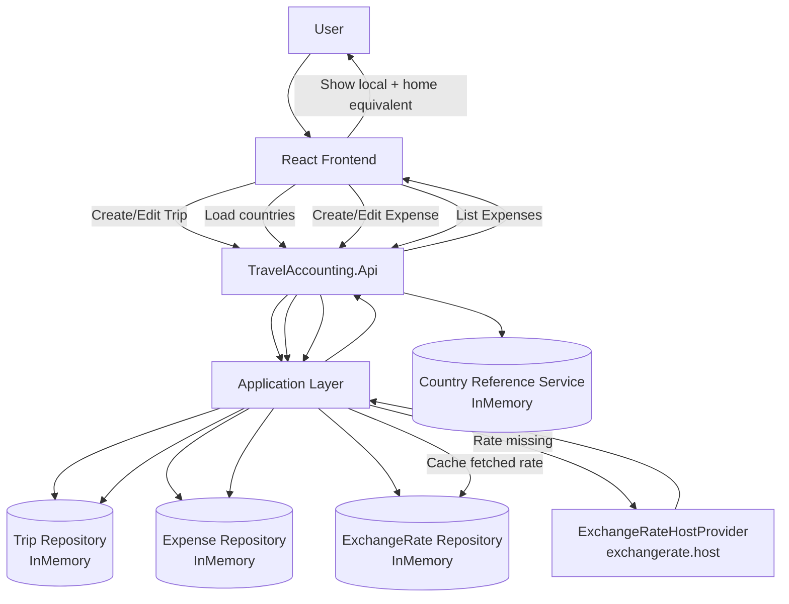
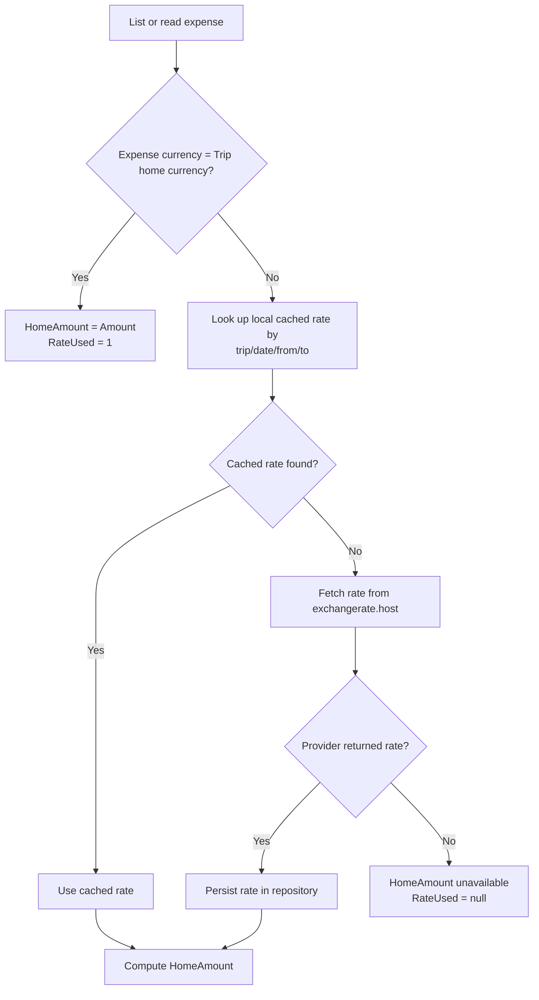

# Workflow Diagram

## End-to-End Workflow

## Conversion Decision Flow

## Notes
- Expense creation does not fail if provider lookup fails.
- When provider/rate is unavailable, expense remains saved and conversion fields are null.
- Conversions are deterministic once a rate is cached for that trip/date/currency pair.
